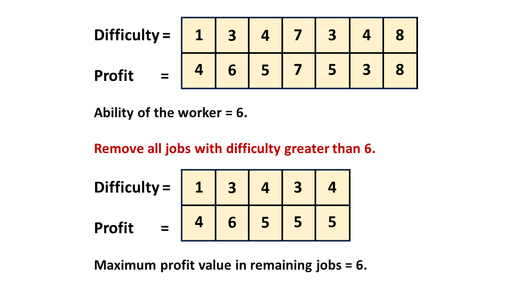

## Solution

------------------------------------------------------------------------

### Overview

We are given some jobs that each have a difficulty level and an amount
of profit that can be made from performing the job. We also have some
workers.

You can think of these jobs as roles within a company. Each worker can
have only one role, and the role must not be too difficult for them.
However, just like in the real world, the assigned role can be easier
than what the worker is capable of handling. Our goal is to assign roles
to workers in a way that maximizes the company's profit.

Constraints on `n` and `m` are `1 <= n` & `m <= 10000`, respectively.
Therefore, we need to consider an approach with linear or log-linear
time complexity.

------------------------------------------------------------------------

### Approach 1: Binary Search and Greedy (Sort by Job Difficulty)

#### Intuition

When assigning a job to any worker, we disregard any jobs that are too
difficult and then select the job with the highest profit. An example is
shown below:



If we need to choose the most optimal job for the worker
algorithmically, we could use a linear search to find the maximum profit
among all jobs. However, this approach would result in a Time Limit
Exceeded (TLE) verdict since each job assignment would take $O(n)$
time, where `n` is the size of the job list.

Another approach is to use a binary search for every worker. We can sort
the `difficulty` array in increasing order to apply binary search and
rearrange the `profits` array in the same order.

For each worker, we will find the index where the difficulty value is
just less than or equal to the worker's ability. The worker can perform
all jobs up to this index. Consequently, the worker will choose the job
with the highest profit up to this index. To do this, we can preprocess
the array to store the maximum profit values up to each index.

During the binary search process, we will add the value of the
preprocessed maximum profit of the calculated job for each worker. This
sum will give us the total profit. Since the profit for each worker is
maximized, the total profit will also be maximized.

#### Algorithm

1. Initialize an array of pairs `jobProfile` with `{0, 0}`.
2. For `i` from `0` to `n` (where `n` is the size of the `difficulty`
    and `profit` arrays):
    - Append `{difficulty[i], profit[i]}` to `jobProfile`.
3. Sort `jobProfile` by `difficulty` in ascending order.
4. For `i` from `0` to `n-1`:
    - Update `jobProfile[i].profit` to be the maximum of its current
      value and the previous profit value.
5. Initialize `netProfit` to `0`.
6. For each `ability` in the `worker` array:
    - Set binary search parameters: `l = 0`, `r = n-1`, `jobProfit = 0`.
    - While `l` \<= `r`:
      - Calculate `mid = (l + r) / 2`.
      - If `jobProfile[mid].difficulty` \<= `ability`:
        - Update `jobProfit` to the maximum of `jobProfit` and
          `jobProfile[mid].profit`.
        - Set `l = mid + 1`.
      - Else:
        - Set `r = mid - 1`.
    - Add `jobProfit` to `netProfit`.
7. Return `netProfit`.  

#### Implementation

```python
class Solution:
    def maxProfitAssignment(
        self, difficulty: List[int], profit: List[int], worker: List[int]
    ) -> int:
        job_profile = [(0, 0)]
        for i in range(len(difficulty)):
            job_profile.append((difficulty[i], profit[i]))
        # Sort by difficulty values in increasing order.

        job_profile.sort()
        for i in range(len(job_profile) - 1):
            job_profile[i + 1] = (
                job_profile[i + 1][0],
                max(job_profile[i][1], job_profile[i + 1][1]),
            )
        net_profit = 0
        for i in range(len(worker)):
            ability = worker[i]

            # Find the job with just smaller or equal difficulty than ability.

            l, r = 0, len(job_profile) - 1
            job_profit = 0
            while l <= r:
                mid = (l + r) // 2
                if job_profile[mid][0] <= ability:
                    job_profit = max(job_profit, job_profile[mid][1])
                    l = mid + 1
                else:
                    r = mid - 1
            # Increment profit of current worker to total profit.

            net_profit += job_profit
        return net_profit
```

<details>
<summary>C++</summary>

```cpp
class Solution {
public:
    int maxProfitAssignment(vector<int>& difficulty, vector<int>& profit,
                            vector<int>& worker) {
        vector<pair<int, int>> jobProfile;
        jobProfile.push_back({0, 0});
        for (int i = 0; i < difficulty.size(); i++) {
            jobProfile.push_back({difficulty[i], profit[i]});
        }

        // Sort by difficulty values in increasing order.
        sort(jobProfile.begin(), jobProfile.end());
        for (int i = 0; i < jobProfile.size() - 1; i++) {
            jobProfile[i + 1].second =
                max(jobProfile[i].second, jobProfile[i + 1].second);
        }

        int netProfit = 0;
        for (int i = 0; i < worker.size(); i++) {
            int ability = worker[i];

            // Find the job with just smaller or equal difficulty than ability.
            int l = 0, r = jobProfile.size() - 1, jobProfit = 0;
            while (l <= r) {
                int mid = (l + r) / 2;
                if (jobProfile[mid].first <= ability) {
                    jobProfit = max(jobProfit, jobProfile[mid].second);
                    l = mid + 1;
                } else {
                    r = mid - 1;
                }
            }

            // Increment profit of current worker to total profit.
            netProfit += jobProfit;
        }
        return netProfit;
    }
};
```

</details>

<details>
<summary>Java</summary>

```java
class Solution {

    public int maxProfitAssignment(
        int[] difficulty,
        int[] profit,
        int[] worker
    ) {
        List<int[]> jobProfile = new ArrayList<>();
        jobProfile.add(new int[] { 0, 0 });
        for (int i = 0; i < difficulty.length; i++) {
            jobProfile.add(new int[] { difficulty[i], profit[i] });
        }

        // Sort by difficulty values in increasing order.
        Collections.sort(jobProfile, (a, b) -> Integer.compare(a[0], b[0]));
        for (int i = 0; i < jobProfile.size() - 1; i++) {
            jobProfile.get(i + 1)[1] = Math.max(
                jobProfile.get(i)[1],
                jobProfile.get(i + 1)[1]
            );
        }

        int netProfit = 0;
        for (int i = 0; i < worker.length; i++) {
            int ability = worker[i];

            // Find the job with just smaller or equal difficulty than ability.
            int l = 0, r = jobProfile.size() - 1, jobProfit = 0;
            while (l <= r) {
                int mid = (l + r) / 2;
                if (jobProfile.get(mid)[0] <= ability) {
                    jobProfit = Math.max(jobProfit, jobProfile.get(mid)[1]);
                    l = mid + 1;
                } else {
                    r = mid - 1;
                }
            }

            // Increment profit of current worker to total profit.
            netProfit += jobProfit;
        }
        return netProfit;
    }
}
```

</details>

#### Complexity Analysis

Let $n$ be the size of the `difficulty` and `profit` arrays, and `m` be
the size of the `worker` array.

- Time complexity: $O(n \cdot \log n + m \cdot \log n)$

  The time complexity for sorting the `jobProfile` array is $O(n \cdot \log n)$.

  While iterating the `worker` array of size `m`, we perform a binary
  search with search space size `n`. The time complexity is given by
  $O(m \cdot \log n)$.

  Therefore, the total time complexity is given by $O(n \cdot \log n + m \cdot \log n)$.

- Space complexity: $O(n)$

  We create an additional `jobProfile` array of size $2 \cdot n$.
  Apart from this, some extra space is used when we sort an array in
  place. The space complexity of the sorting algorithm depends on the
  programming language.

  - In Python, the `sort` method sorts a list using the Tim Sort
    algorithm which is a combination of Merge Sort and Insertion Sort
    and has $O(n)$ additional space. Additionally, Tim Sort is
    designed to be a stable algorithm.
  - In Java, `Arrays.sort()` is implemented using a variant of the Quick
    Sort algorithm which has a space complexity of $O( \log n)$ for sorting an array.
  - In C++, the `sort()` function is implemented as a hybrid of Quick
    Sort, Heap Sort, and Insertion Sort, with a worse-case space
    complexity of $O( \log n)$.

  Therefore, space complexity is given by $O(n)$.

------------------------------------------------------------------------

### Approach 2: Binary Search and Greedy (Sort by profit)

#### Intuition

Is it possible to use binary search on the `profit` array to maximize
the profit for a worker?

Suppose we sort the `profit` array in decreasing order while rearranging
the `difficulty` array to preserve the original ordering of indices. For
each worker, we will find the first index where the value of difficulty
is less than or equal to the worker's ability. This index will store the
maximum profit possible for that worker's ability. To efficiently apply
binary search, we can preprocess the array to store the minimum
difficulty up to the current index.

Similar to the previous approach, we will return the sum of all
individual job profits as the maximum total profit.

#### Algorithm

1. Initialize an array of pairs `jobProfile` with `{0, 0}`.
2. For `i` from `0` to `n` (where `n` is the size of the `difficulty`
    and `profit` arrays):
    - Append `{difficulty[i], profit[i]}` to `jobProfile`.
3. Sort `jobProfile` by `profit` in descending order.
4. For `i` from `0` to `n-1`:
    - Update `jobProfile[i].difficulty` to be the minimum of its current
      value and the previous difficulty value.
5. Initialize `netProfit` to `0`.
6. For each `ability` in the `worker` array:
    - Set binary search parameters: `l = 0`, `r = n-1`, `jobProfit = 0`.
    - While `l` \<= `r`:
      - Calculate `mid = (l + r) / 2`.
      - If `jobProfile[mid].difficulty` \<= `ability`:
        - Update `jobProfit` to the maximum of `jobProfit` and
          `jobProfile[mid].profit`.
        - Set `r = mid - 1`.
      - Else:
        - Set `l = mid + 1`.
    - Add `jobProfit` to `netProfit`.
7. Return `netProfit`.  

#### Implementation

```python
class Solution:
    def maxProfitAssignment(
        self, difficulty: List[int], profit: List[int], worker: List[int]
    ) -> int:
        job_profile = [(0, 0)]
        for i in range(len(difficulty)):
            job_profile.append((profit[i], difficulty[i]))

        # Sort in decreasing order of profit.
        job_profile.sort(reverse=True)
        for i in range(len(job_profile) - 1):
            job_profile[i + 1] = (
                job_profile[i + 1][0],
                min(job_profile[i][1], job_profile[i + 1][1]),
            )

        net_profit = 0
        for ability in worker:
            # Maximize profit using binary search.
            l, r = 0, len(job_profile) - 1
            job_profit = 0
            while l <= r:
                mid = (l + r) // 2
                if job_profile[mid][1] <= ability:
                    job_profit = max(job_profit, job_profile[mid][0])
                    r = mid - 1
                else:
                    l = mid + 1
            # Add profit of each worker to total profit.
            net_profit += job_profit

        return net_profit
```

<details>
<summary>C++</summary>

```cpp
class Solution {
public:
    int maxProfitAssignment(vector<int>& difficulty, vector<int>& profit,
                            vector<int>& worker) {
        vector<pair<int, int>> jobProfile;
        jobProfile.push_back({0, 0});
        for (int i = 0; i < difficulty.size(); i++) {
            jobProfile.push_back({profit[i], difficulty[i]});
        }

        // Sort in decreasing order of profit.
        sort(jobProfile.begin(), jobProfile.end());
        reverse(jobProfile.begin(), jobProfile.end());
        for (int i = 0; i < jobProfile.size() - 1; i++) {
            jobProfile[i + 1].second =
                min(jobProfile[i].second, jobProfile[i + 1].second);
        }

        int netProfit = 0;
        for (int i = 0; i < worker.size(); i++) {
            int ability = worker[i];
            // Maximize profit using binary search.
            int l = 0, r = jobProfile.size() - 1, jobProfit = 0;
            while (l <= r) {
                int mid = (l + r) / 2;
                if (jobProfile[mid].second <= ability) {
                    jobProfit = max(jobProfit, jobProfile[mid].first);
                    r = mid - 1;
                } else {
                    l = mid + 1;
                }
            }
            // Add profit of each worker to total profit.
            netProfit += jobProfit;
        }
        return netProfit;
    }
};
```

</details>

<details>
<summary>Java</summary>

```java
class Solution {

    public int maxProfitAssignment(
        int[] difficulty,
        int[] profit,
        int[] worker
    ) {
        List<int[]> jobProfile = new ArrayList<>();
        jobProfile.add(new int[] { 0, 0 });
        for (int i = 0; i < difficulty.length; i++) {
            jobProfile.add(new int[] { profit[i], difficulty[i] });
        }

        // Sort in decreasing order of profit.
        jobProfile.sort((a, b) -> Integer.compare(b[0], a[0]));
        for (int i = 0; i < jobProfile.size() - 1; i++) {
            jobProfile.get(i + 1)[1] = Math.min(
                jobProfile.get(i)[1],
                jobProfile.get(i + 1)[1]
            );
        }

        int netProfit = 0;
        for (int i = 0; i < worker.length; i++) {
            int ability = worker[i];
            // Maximize profit using binary search.
            int l = 0, r = jobProfile.size() - 1, jobProfit = 0;
            while (l <= r) {
                int mid = (l + r) / 2;
                if (jobProfile.get(mid)[1] <= ability) {
                    jobProfit = Math.max(jobProfit, jobProfile.get(mid)[0]);
                    r = mid - 1;
                } else {
                    l = mid + 1;
                }
            }
            // Add profit of each worker to total profit.
            netProfit += jobProfit;
        }
        return netProfit;
    }
}
```

</details>

#### Complexity Analysis

Let $n$ be the size of the `difficulty` and `profit` arrays and `m` be
the size of the `worker` array.

- Time complexity: $O(n \cdot \log n + m \cdot \log n)$

  The time complexity for sorting the difficulty array is $O(n \cdot \log n)$.

  While iterating the `worker` array of size `m`, we perform a binary
  search with search space size `n`. The time complexity for is given by
  $O(m \cdot \log n)$.

  Therefore, the total time complexity is given by $O(n \cdot \log n + m \cdot \log n)$.

- Space complexity: O(n)O(n)O(n)

  We create an additional `jobProfile` array of size $2 \cdot n$.
  Apart from this, some extra space is used when we sort an array in
  place. The space complexity of the sorting algorithm depends on the
  programming language.

  - In Python, the `sort` method sorts a list using the Tim Sort
    algorithm which is a combination of Merge Sort and Insertion Sort
    and has $O(n)$ additional space. Additionally, Tim Sort is
    designed to be a stable algorithm.
  - In Java, `Arrays.sort()` is implemented using a variant of the Quick
    Sort algorithm which has a space complexity of $O( \log n)$ for sorting an array.
  - In C++, the `sort()` function is implemented as a hybrid of Quick
    Sort, Heap Sort, and Insertion Sort, with a worse-case space
    complexity of $O( \log n)$.

  Therefore, space complexity is given by $O(n)$.

------------------------------------------------------------------------

### Approach 3: Greedy and Two-Pointers

#### Intuition

In the first approach, we sorted the `jobProfile` array by difficulty
values. Now, let's also sort the `worker` array in increasing order.

Once we've assigned the optimal job to a worker, then all the workers
ahead of that worker (in ability) will receive a job with difficulty
greater than or equal to the assigned job. Therefore, after assigning a
job, we don't need the jobs present before it.

So, we can use two pointers to find the most optimal job while iterating
through the sorted job profile and sorted worker arrays.

Start with the first worker and iterate through the list maintaining a
maxima of profits until you find the last assignable job with maximum
difficulty. The maximum profit up to this index will give us the profit
of the first worker.

Since the worker array is sorted, the ability of the next worker will be
greater than all previous workers. So, continue iterating the job
profile until you find the last assignable job. Repeat the process for
all workers and store the total profit as the sum of the maximum profit.

#### Algorithm

1. Initialize an array of pairs `jobProfile`.
2. For `i` from `0` to `n` (where `n` is the size of the `difficulty`
    and `profit` arrays):
    - Append `{difficulty[i], profit[i]}` to `jobProfile`.
3. Sort `jobProfile` by `difficulty` in ascending order.
4. Sort `worker` in ascending order by their abilities.
5. Initialize `netProfit`, `maxProfit`, and `index` to `0`.
6. For each `ability` in the `worker` array:
    - While `index` is within bounds and the worker's ability is greater
      than or equal to `jobProfile[index].difficulty`:
      - Update `maxProfit` to the maximum of `maxProfit` and
        `jobProfile[index].profit`.
      - Increment `index` by `1`.
    - Add `maxProfit` to `netProfit`.
7. Return `netProfit`.

#### Implementation

#### Complexity Analysis

Let nnn be the size of the `difficulty` and `profit` arrays and `m` be
the size of the `worker` array.

- Time complexity: O(n⋅log⁡n+m⋅log⁡(m))O(n \cdot \log n + m \cdot
  \log(m))O(n⋅logn+m⋅log(m))

  The time taken for sorting the `difficulty` array is O(n⋅log⁡n)O(n
  \cdot \log n)O(n⋅logn) and sorting the `worker` array is
  O(m⋅log⁡(m))O(m \cdot \log(m))O(m⋅log(m)).

  In the two pointers, while iterating through the `worker` array we
  iterate the `jobProfile` array exactly once. Time complexity is given
  by O(n+m)O(n + m)O(n+m)

  Therefore, the total time complexity is given by O(n⋅log⁡n+m⋅log⁡(m))O(n
  \cdot \log n + m \cdot \log(m))O(n⋅logn+m⋅log(m)).

- Space complexity: O(n)O(n)O(n)

  We create an additional `jobProfile` array of size 2⋅n2 \cdot n2⋅n.
  Apart from this, some extra space is used when we sort an array in
  place. The space complexity of the sorting algorithm depends on the
  programming language.

  - In Python, the `sort` method sorts a list using the Tim Sort
    algorithm which is a combination of Merge Sort and Insertion Sort
    and has O(n)O(n)O(n) additional space. Additionally, Tim Sort is
    designed to be a stable algorithm.
  - In Java, `Arrays.sort()` is implemented using a variant of the Quick
    Sort algorithm which has a space complexity of O(log⁡n)O( \log
    n)O(logn) for sorting an array.
  - In C++, the `sort()` function is implemented as a hybrid of Quick
    Sort, Heap Sort, and Insertion Sort, with a worse-case space
    complexity of O(log⁡n)O( \log n)O(logn).

  Therefore, space complexity is given by O(n)O(n)O(n).

------------------------------------------------------------------------

### Approach 4: Memoization

#### Intuition

Given the constraints on the maximum values of the `difficulty` and
`ability` arrays, we can create an array of this size to store the
maximum profit for every possible ability.

We don't need the profit of jobs with a difficulty level higher than
what the worker can handle. Therefore, we can create an array sized to
the maximum ability to store the results.

Store the profit in this array with the difficulty of each job as the
index. If multiple jobs share the same difficulty (same index), store
the maximum profit among them.

Now, what if there exists a job with difficulty lower than another job
but provides a higher profit? To find the maximum profit at each index,
we must determine the highest value occurrence in all indices up to the
current index. To do this, we need to store the maxima of all previous
profit values in this array while iterating through the abilities.

Therefore, the maximum total profit is given by the sum of values in
this array with worker abilities as the indices.

#### Algorithm

1. Initialize `maxAbility` as the maximum ability in the `worker`
    array.
2. Initialize an array `jobs` of size `maxAbility`.
3. Iterate a variable `i` from 0 to `difficulty.size - 1`:
    - If the `difficulty` at the current index `i` is less than or equal
      to the worker's ability:
      - Store the `profit` at index `i` at the `difficulty[i]` index of
        `jobs` array. If a value already exists, take the maximum of
        both values.
4. Iterate through all values in `jobs`:
    - Store the maximum of current and previous `jobs` values in the
      current `jobs` index.
5. Iterate through all abilities in the `worker` array:
    - Store `maxProfit` as `jobs[ability]` where `ability` denotes the
      ability of the current worker.
    - Increment `maxProfit` to `netProfit`.
6. Return `netProfit`.

#### Implementation

#### Complexity Analysis

Let nnn be the size of the `difficulty` and `profit` arrays and `m` be
the size of the `worker` array. Also, let `maxAbility` be the maximum
value in the `worker` array.

- Time complexity: O(n+m+maxAbility)O(n + m +
  maxAbility)O(n+m+maxAbility)

  In this approach, we iterate through the `difficulty`, `worker` and
  `jobs` arrays exactly once.

  Therefore, the total time complexity is given by
  O(n+m+maxAbility)O(n + m + maxAbility)O(n+m+maxAbility).

- Space complexity: O(maxAbility)O(maxAbility)O(maxAbility)

  We create an additional `jobs` array of size
  maxAbilitymaxAbilitymaxAbility. Apart from this, no additional space
  is used.

  Therefore, space complexity is given by
  O(maxAbility)O(maxAbility)O(maxAbility).

------------------------------------------------------------------------
